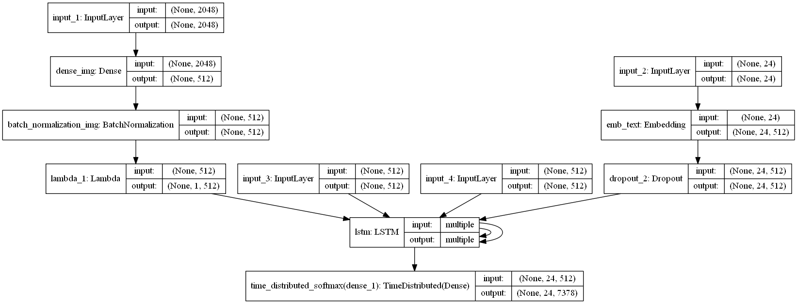
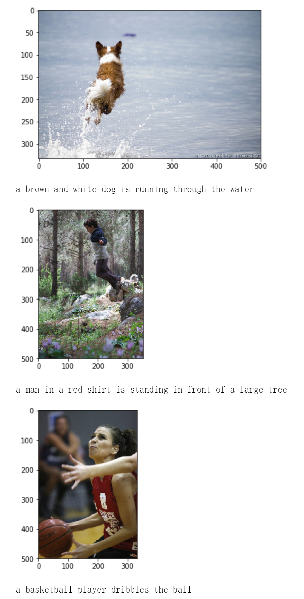

# Show And Tell Keras Implementation
Keras implementation of Neural Image Caption Generator(NIC) 

**Related paper** : [Vinyals, Oriol, et al. "Show and tell: A neural image caption generator." computer vision and pattern recognition (2015): 3156-3164.](https://www.cv-foundation.org/openaccess/content_cvpr_2015/papers/Vinyals_Show_and_Tell_2015_CVPR_paper.pdf)

**Trained on**: [Flickr8k](https://forms.illinois.edu/sec/1713398)

**Inspired by** :  
* [How to Develop a Deep Learning Photo Caption Generator from Scratch](https://machinelearningmastery.com/develop-a-deep-learning-caption-generation-model-in-python/)
* [Where to put the Image in an Image Caption Generator](https://arxiv.org/abs/1703.09137)

# Environment and Dependency

Code works well under these settings(Maybe also works well for other settings):

* python 3.6.8

* keras 2.2.4 tensorflow backend 

* numpy 1.15.4

* nltk 3.4

* PIL 5.4.1

* tensorflow 1.12.0 (Only use to define the TensorBoardCaption to monitor the captions genrated during the training by tensorboard, if you don't need it is ok to bypass tensorflow module)

# Model Architecture

# Model weights
* **current_best.h5**: current best model weights. Put it in the ./model-params

* **features_dict.pkl**: all filckr8k image features extracted by Inception_v3. Put it in the ./datasets

* [Here to Download, Google Drive](https://drive.google.com/drive/folders/1ZRB5tLyt9N776kBNoYDLJubaxVp6M8f2?usp=sharing)

# Performance

(Use beam search size=5)

**Evaluation by evaluate.py**
> BLEU-1 0.608  BLEU-2 0.419 BLEU-3 0.272 BLEU-4 0.184 

**Evaluation by [pycocoevalcap](https://github.com/tylin/coco-caption)**
> CIDEr: 0.532 Bleu_4: 0.210 Bleu_3: 0.305 Bleu_2: 0.442 Bleu_1: 0.625 ROUGE_L: 0.460 
METEOR: 0.202 SPICE: 0.144 

**Examples**: 
* Use **NIC Interactive.ipynb** to visualize and generate captions of specific images(Images in folder './put-your-image-here')

# TensorBoardCaption
* A keras callback function to monitor small amount of images' current caption during training by tensorboard

